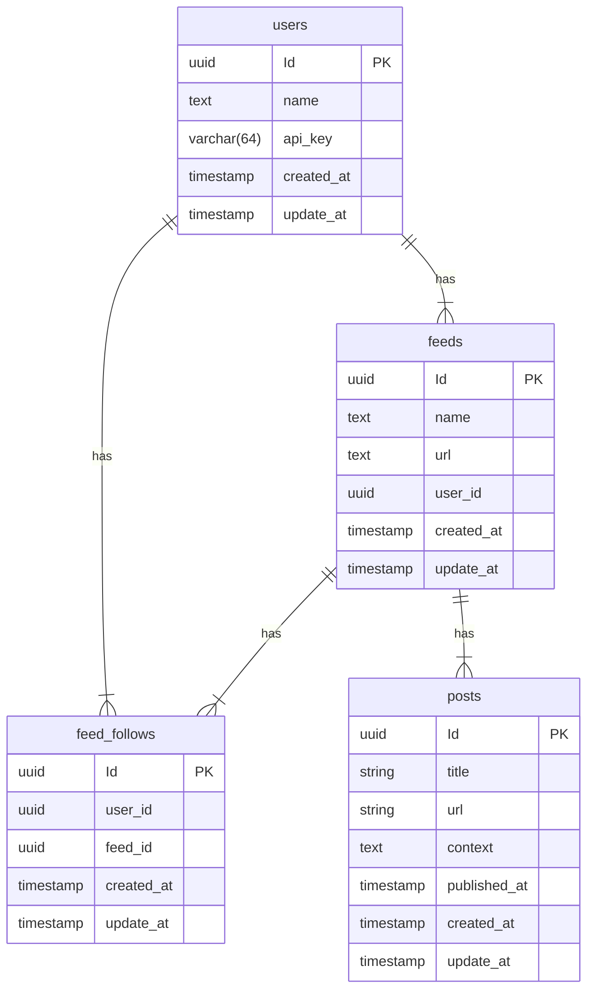

# RSS Scraper

This is a simple RSS scraper that fetches RSS feeds from a list of URLs and stores them in a database.

## Features

* A user can create an account
* A user can create a feed
* A user can follow a feed
* A user can unfollow a feed
* A user can view all feeds they follow
* A user can view all posts from feeds they follow


## Libraries used

* [Sqlc](https://sqlc.dev/) - For type-safe SQL queries
* [ogen](https://ogen.dev/) - For generating Go code from OpenAPI specs
* [Goose](https://pressly.github.io/goose/) - For managing migrations

## Database Schema




## How to run

### Install dependencies

```sh
go mod download
```

### Generate code from OpenAPI spec

```sh
go generate ./...
```

### Run the server

```sh
go run cmd/main.go
```

### Run migrations

```sh
go run cmd/migrate.go
```

### Run tests

```sh
go test ./...
```


